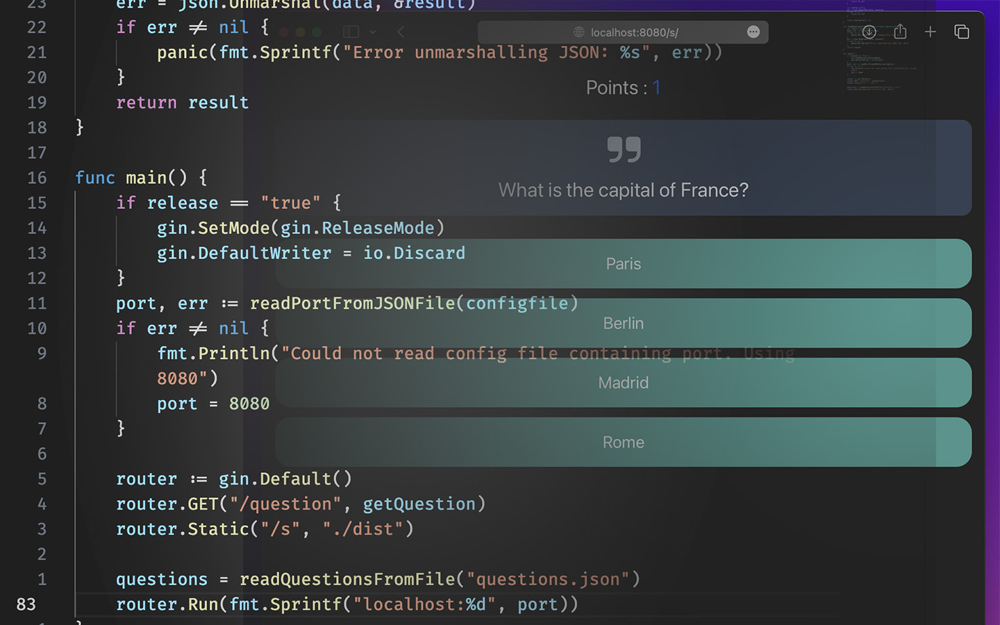
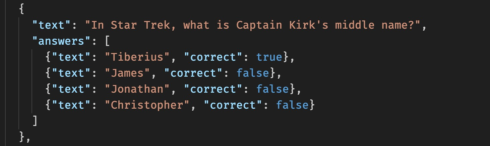

# QuizServer

Small Fullstack Application to host a quiz server. Server is writting in go with gin and Client is a Typescript and Vue project.

Questions are read from json file at runtime.




# Building

Just run 

```bash
    sh ./build.sh
```

# Manual Building

If your want to build Server and Client manually follow these steps.

## Building the Server

In the Server folder run:

For Release Build:
```bash
go build -ldflags "-X main.release=true"
```
For Debug Build:
```bash
go build -ldflags "-X main.release=false" -o DebugServer
```

## Building the Client

In the Client folder run:

```bash
npm run build
```

Output will be placed in the dist folder inside of the Server directory.

# Running and Using

Just start the Server

```bash
cd Server
./QuizServer
```

You can reach the application at http://localhost:8080/s/


